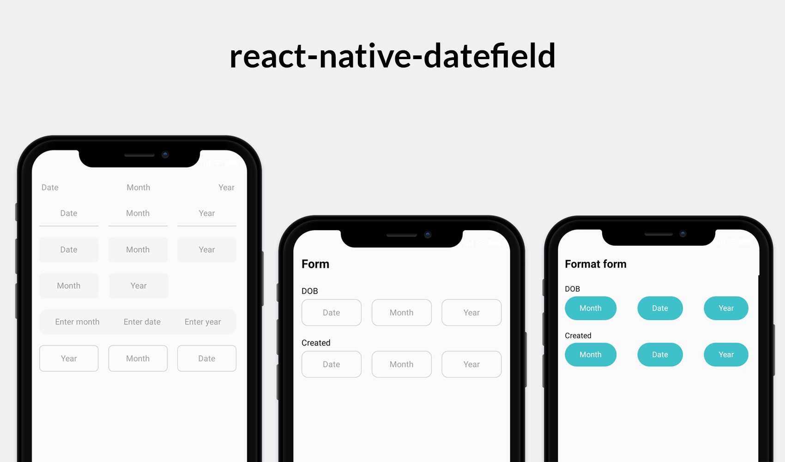

<h1 align="center">react-native-datefield</h1>

<br />

<p align="center">
  A simple React Native date input component
</p>

<p align="center">
  <a href="https://www.npmjs.com/package/react-native-datefield"></a>
  <a href="https://github.com/tuantvk/react-native-datefield"></a>
  <a href="https://github.com/tuantvk/react-native-datefield"></a>
  <a href="https://github.com/tuantvk/react-native-datefield"></a>
  <a href="https://github.com/prettier/prettier"></a>
  <a href="https://opensource.org/licenses/MIT"></a>
</p>

<br />




## Installation

```sh
yarn add react-native-datefield

or

npm install react-native-datefield
```


## Usage

```js
import DateField from 'react-native-datefield';
```

or

```js
const DateField = require('react-native-datefield');
```

```js
<DateField
  styleInput={styles.inputBorder}
  onSubmit={(value) => console.log(value)}
/>

<DateField
  labelDate="Input date"
  labelMonth="Input month"
  labelYear="Input year"
  styleInput={styles.inputBorder}
  onSubmit={(value) => console.log(value)}
/>

<DateField
  editable={false}
  defaultValue={new Date()}
  styleInput={styles.inputBorder}
  containerStyle={{ marginVertical: 20 }}
/>

const styles = StyleSheet.create({
  inputBorder: {
    width: '30%',
    borderRadius: 8,
    borderColor: '#cacaca',
    borderWidth: 1,
    marginBottom: 20,
  },
});
```

## Props

| Property        | Default       | Option      | Description  |
| --------------- |:-------------:|:-----------:|:------------:|
| testID          | -             | string      | used to locate this view in end-to-end tests |
| containerStyle  | -             | ViewStyle   | styling for view containing the input |
| styleInput      | -             | TextStyle   | style that will be passed to the `style` props of the React Native `TextInput` |
| labelDate       | `Date`        | string      | add a label for date input |
| labelMonth      | `Month`       | string      | add a label for month input |
| labelYear       | `Year`        | string      | add a label for year input |
| defaultValue    | -             | Date        | an initial value that will change when the user starts typing |
| onSubmit        | -             | (Date) => {}| callback that is called when blur and return `Date` value |
| editable        | `false`       | boolean     | if `false`, text is not editable |
| hideDate        | `false`       | boolean     | if `true`, `Date` input is not display, only support `DateField` |
| placeholderTextColor | -        | string      | the text color of the placeholder string |


## Example

#### MonthDateYearField

Display fields according to `month -> date -> year`.

```js
import { MonthDateYearField } from 'react-native-datefield';

<MonthDateYearField
  labelDate='Enter date'
  labelMonth='Enter month'
  labelYear='Enter year'
  containerStyle={styles.containerStyle}
  onSubmit={(value) => console.log('MonthDateYearField', value)}
/>

const styles = StyleSheet.create({
  containerStyle: {
    borderRadius: 15,
    backgroundColor: '#f4f4f4',
    paddingHorizontal: 25,
    marginBottom: 20,
  },
});
```

#### YearMonthDateField

Display fields according to `year -> month -> date`.

```js
import { YearMonthDateField } from 'react-native-datefield';

<YearMonthDateField
  styleInput={styles.inputBorder}
  onSubmit={(value) => console.log('YearMonthDateField', value)}
/>

const styles = StyleSheet.create({
  inputBorder: {
    width: '30%',
    borderRadius: 8,
    borderColor: '#cacaca',
    borderWidth: 1,
    marginBottom: 20,
  },
});
```

View more example [App.tsx](https://github.com/tuantvk/react-native-datefield/blob/master/example/src/App.tsx).


## Running the example app

1. Run `yarn` in repo root
2. Run `cd example`
3. Install required pods by running `npx pod-install`
4. Run `yarn start` to start Metro Bundler
5. Run `yarn run start:ios` or `yarn run start:android` or `yarn run start:windows`


## Contributing

See the [contributing guide](CONTRIBUTING.md) to learn how to contribute to the repository and the development workflow.


## Contributors

<table>
  <tr>
    <td align="center">
      <a href="https://github.com/tuantvk">
        
        <br />
        <sub><b>tuantvk</b></sub>
      </a>
      <br />
      <a href="https://github.com/tuantvk/react-native-datefield/commits?author=tuantvk" title="Code">💻</a>
      <a href="#" title="Maintenance">🚧</a>
      <a href="https://github.com/tuantvk/react-native-datefield/commits?author=tuantvk" title="Documentation">📖</a>
      <a href="#" title="Examples">💡</a>
    </td>
  </tr>
</table>

## License

MIT
